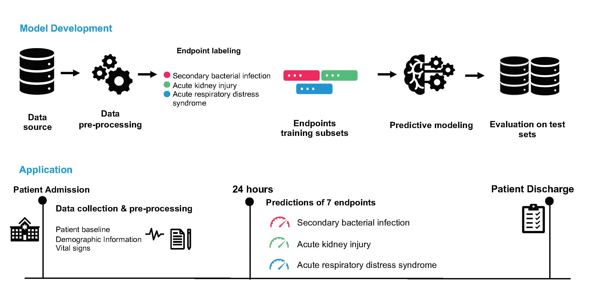

# Clinical prediction system of complications among COVID-19 patients: a development and validation retrospective multicentre study

Table of contents
=================

<!--ts-->
   * [About the repository](#About-the-repository)
      * [Background](#Background)
      * [Overview](#Overview)
      * [Requirements](#Requirements)
   * [Repository Content](#Repository-Content)
      * [dataset](#dataset)
      * [code](#code)
      * [notebooks](#notebooks)
      * [trained models](#trained_models)
   * [Reference](#Reference)
   
<!--te-->
About the repository
============
The code provided in this repository belongs to the work completed for (citation ). The code is provided for reproducibility and application of our system and training framework to external clinical datasets.

Background
----------
With the sharp increase in global recorded cases, COVID-19 has put a strain on healthcare systems worldwide. Clinical evidence suggests that COVID-19 may result in a set of non-mortal complications including elevated d-dimer, interleukin-6, aminotransferases, and troponin levels, secondary bacterial infections, acute kidney injury, and acute respiratory distress syndrome.  However, most of the published prognostic tools focus on predicting mortality and the knowledge of predictors of such complications is fairly limited.  Here, we aimed to develop an accurate prognostic system for non-mortal complications and to identify the most predictive clinical features of each complication.  We designed a prognostic system that predicts the risk of developing each complication, secondary to a COVID-19 diagnosis, using the clinical data collected during the patient’s first 24 hours of admission and a complication-specific gradient boosting ensemble.  The system was assessed using the area under the receiver operating characteristic curve (AUROC) and the area under the precision recall curve (AUPRC). Through accurate predictions of the onset of non-mortal complications, we hope to aid in improving patient outcomes as well as the efficiency of hospital resource management.

Requirements
--------------
Please clone and download the project, unzip it to your preferred folder. Then follow the below steps to setup the environment.

```
conda env create -f environment.yml
conda activate covid
```

Overview
--------
The proposed system predicts the risk of developing each of the complications during the patient’s stay after 24hours of admission. The final output of our system is a vector of seven risk scores, corresponding to each of the investigated complications secondary to COVID-19.


Repository Content
====================


dataset
--------
The dataset folder includes a test set (n= 225), which is the same as test set B shown in the paper. This test set is provided to demonstrate how our system is applied to real COVID-19 data.

code
-----------------------------

This folder includes the scripts used to stratify the data into complication-specific subsets, perform hyperparameter search, model selection as well as performance evaluation.
To train and test the models run either the ```run_notebook.ipynb``` or  the following script file: 

``` python code/run.py ```

trained models
-------------
In this folder, we include our trained models to allow for reproducability of our work and testing on external datasets. For each complication, there are 6 stored models per ensemble. Further details on using and testing the models are shown in the ```testing_models.ipynb```.

notebooks
---------
In this folder we include 2 notebooks:
* ```run_notebook.ipynb```: This notebook demonstrates how to apply the system, including training and testing on your own datasets.

* ```testing_models.ipynb```: This notebook demonstrates the testing of our previously trained models on the provided test set.


Reference
=========
For this work, please cite: ...... TO ADD
